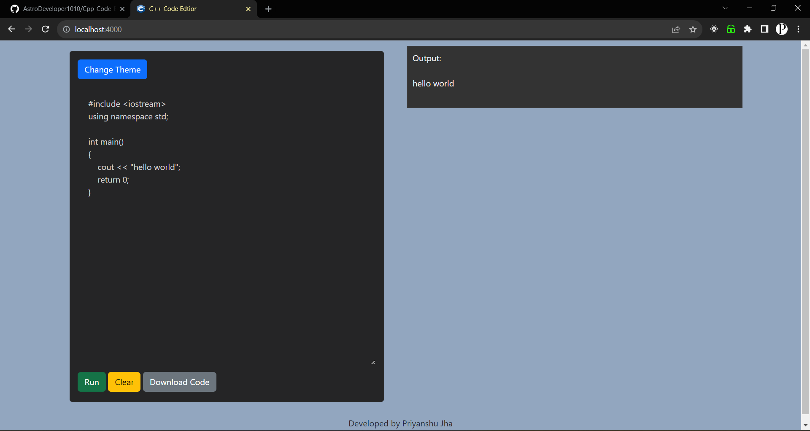

# Online C++ Editor App 🖥️

The Online C++ Editor App is a web-based application that allows users to write, compile, and run C++ code directly from their web browsers. This application utilizes EJS, CSS, JavaScript, Node.js, and Express to provide a seamless coding experience.

## Features 🚀

- **Code Editing:** ✏️ Write and edit C++ code in a user-friendly code editor.
- **Compilation:** 🛠️ Compile C++ code on the server to check for syntax and compilation errors.
- **Output Display:** 👀 View the output of the compiled C++ code directly on the web interface.
- **Responsive Design:** 📱 The app is designed to be responsive and work well on various screen sizes.
- **Easy to Use:** 🌟 The intuitive user interface makes it simple for both beginners and experienced programmers to use.

## Output 👨‍💻
<!--  -->

## Requirements 📋

- Node.js: Make sure you have Node.js installed on your machine.
- Internet Browser: The app is compatible with major modern browsers like Chrome, Firefox, and Safari.

## Installation 🔧

1. Clone this repository to your local machine.

git clone https://github.com/AstroDeveloper1010/Cpp-Code-Editor.git

2. Navigate to the project directory.

3. Install the required dependencies using npm (Node Package Manager).

## Usage 🛠️

1. Start the Node.js server.

2. Open your web browser and navigate to `http://localhost:4000` to access the Online C++ Editor App.

3. Write or paste your C++ code into the editor.

4. Click the "Compile" button to send your code to the server for compilation.

5. The server will compile the code and display the output below the editor.

## Technologies Used 💻

- **EJS:** Templating engine for generating dynamic HTML pages.
- **CSS:** Styling and layout of the web application.
- **JavaScript:** Adding interactivity and client-side functionality.
- **Node.js:** Backend JavaScript runtime.
- **Express:** Web framework for building the server and handling requests.

## License 📄

This project is licensed under the [MIT License](LICENSE).

## Acknowledgments 🙌

- This project was inspired by the need for a simple online C++ editor.
- Thanks to the open-source community for providing the tools and libraries necessary to build this app.

---

Feel free to contribute, report issues, and share your feedback about the Online C++ Editor App. Happy coding!
